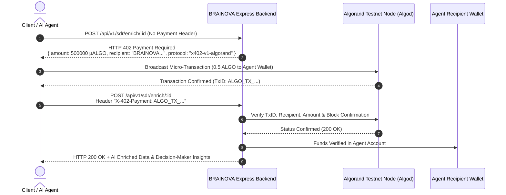

# 🚀 BRAINOVA — Autonomous AI Sales Development Representative (SDR) Agent
### ⚡ Powered by MERN Stack & Algorand x402 Micropayment Protocol
**InnoFusion 3.0 × Algorand x402 Track Submission**  
**Track:** `x402-Powered Applications` / `Agentic Commerce Infrastructure`  
**Institution:** Institute of Engineering and Management (IEM), Kolkata / UEM  
**Team Name:** BRAINOVA  
**Team Members:** Swastika Paul, Sayani Ghosal, Hritushree Mitra, Sania Kundu, Kaveri Kumari  

---

## 📌 Executive Summary & Problem Statement

Sales Development Representatives (SDRs) spend **over 70% of their working hours** on tedious, manual tasks: scraping contact profiles, drafting cold emails, chasing unresponsive leads, and booking calendar meetings. Traditional SDR agencies and legacy enterprise SaaS solutions cost $4,000 to $8,000/month with rigid lock-in contracts and high lead error rates.

**BRAINOVA** solves this by delivering a **fully autonomous AI Sales Development Representative (SDR) Agent** that executes the entire 10-step outbound sales funnel end-to-end. Built with the **MERN Stack (MongoDB, Express, React, Node.js)** and integrated natively with **Algorand's x402 HTTP "Payment Required" standard**, BRAINOVA enables zero-subscription, machine-to-machine micropayments (0.5 to 2.0 ALGO) per enriched prospect and verified meeting.

---

## 🔄 The 10-Step Autonomous Sales Funnel

```
┌────────────────────────────────────────────────────────────────────────┐
│                        BRAINOVA 10-STEP PIPELINE                       │
├────────────────────────────────────────────────────────────────────────┤
│                                                                        │
│  1. Lead Discovery ────► Scrapes & normalizes high-intent B2B leads    │
│           │                                                            │
│  2. AI Enrichment ─────► Extracts tech stack, pain points & ICP score  │
│           │              (⚡ Protected via Algorand x402: 0.5 ALGO)    │
│  3. Lead Scoring ──────► Predicts intent (0-100) & decision-maker rank │
│           │                                                            │
│  4. Outreach Gen ──────► Synthesizes personalized Email & WhatsApp copy│
│           │                                                            │
│  5. AI Conversation ───► Multi-turn NLP objection & inquiry handling   │
│           │                                                            │
│  6. Qualification ─────► BANT validation (Budget, Authority, Need, Time│
│           │                                                            │
│  7. Meeting Scheduling ► Autonomous Google Meet / Calendly booking     │
│           │                                                            │
│  8. CRM Update ────────► Instant two-way sync with HubSpot/Salesforce  │
│           │                                                            │
│  9. Funnel Analytics ──► Real-time conversion & CAC savings metrics    │
│           │                                                            │
│ 10. x402 Monetization ─► Instant on-chain micro-settlement on Algorand │
│                                                                        │
└────────────────────────────────────────────────────────────────────────┘
```

---

## 🌐 Algorand x402 Payment Protocol Architecture

The **x402 Protocol** leverages the native HTTP status code `402 Payment Required` to provide automated, trustless micro-settlements between AI agents and client applications on the Algorand blockchain.



---

## 🛠️ Technology Stack

| Layer | Technologies Used |
|---|---|
| **Frontend** | React 18, Vite, Modern Vanilla CSS Design System, Lucide Icons, Glassmorphism UI |
| **Backend** | Node.js, Express.js, RESTful Architecture, CORS, Dotenv |
| **Database** | MongoDB & Mongoose ODM (Leads, Outreach Threads, x402 Ledger) |
| **Blockchain / Web3** | Algorand SDK (`algosdk`), Algorand Testnet, x402 HTTP Protocol |
| **AI / Machine Learning** | OpenAI GPT-4 / Claude / NLP Sentiment & Objection Handling Engine |
| **Integrations** | HubSpot CRM API, Salesforce, Google Calendar API, WhatsApp Business API |

---

## 📂 Project Repository Structure

```
brainova-ai-sdr/
├── backend/
│   ├── controllers/
│   │   └── sdrController.js          # 10-Step Funnel logic & pipeline execution
│   ├── middleware/
│   │   └── x402Auth.js               # Algorand HTTP 402 Payment Required middleware
│   ├── models/
│   │   ├── Lead.js                   # Mongoose Lead schema with x402 payment tracking
│   │   └── Transaction.js            # Algorand on-chain transaction ledger
│   ├── routes/
│   │   ├── sdrRoutes.js              # SDR pipeline routes (Free & x402-protected)
│   │   └── x402Routes.js             # Pricing, wallet, verification, and ledger routes
│   ├── services/
│   │   ├── aiAgentService.js         # NLP objection engine, enrichment & scoring
│   │   └── algorandService.js        # Algorand node client & on-chain tx verification
│   ├── .env.example                  # Environment configuration template
│   ├── package.json                  # Backend dependencies
│   └── server.js                     # Express server entrypoint & demo seeder
├── frontend/
│   ├── src/
│   │   ├── components/
│   │   │   ├── PipelineWorkflow.jsx  # 10-Step visual interactive pipeline
│   │   │   ├── LeadTable.jsx         # Pipeline manager & stage action buttons
│   │   │   ├── AIConversationSimulator.jsx # Multi-turn NLP objection simulator
│   │   │   ├── X402PaywallModal.jsx  # Algorand micropayment paywall modal
│   │   │   └── AnalyticsView.jsx     # Funnel KPIs & Algorand x402 ledger
│   │   ├── App.jsx                   # Main React state coordinator & tab router
│   │   ├── index.css                 # Dark glassmorphism styling & glowing accents
│   │   └── main.jsx                  # React DOM mount point
│   ├── index.html                    # HTML document with Google Fonts
│   ├── package.json                  # Frontend dependencies
│   └── vite.config.js                # Vite development server & proxy
├── package.json                      # Root workspace orchestrator
└── README.md                         # Complete project documentation & guide
```

---

## 🚀 Quickstart & Installation

### 1. Prerequisites
- **Node.js**: v18.0 or higher
- **MongoDB**: Local MongoDB or free MongoDB Atlas URI
- **Algorand Testnet Account**: Free testnet dispenser tokens

### 2. Clone & Install Dependencies
```bash
git clone https://github.com/your-username/brainova-ai-sdr.git
cd brainova-ai-sdr

# Install all dependencies across root, backend, and frontend
npm run install-all
```

### 3. Configure Environment Variables
Create a `.env` file in `backend/.env`:
```env
PORT=5000
NODE_ENV=development
MONGO_URI=mongodb://localhost:27017/brainova_ai_sdr
OPENAI_API_KEY=your_openai_key_here
ALGOD_SERVER=https://testnet-api.algonode.cloud
ALGOD_PORT=443
ALGOD_TOKEN=
AGENT_ALGORAND_WALLET_ADDRESS=YOUR_ALGORAND_TESTNET_ADDRESS
```

### 4. Run Locally
```bash
# Start backend and frontend concurrently
npm run dev
```
- **Frontend Dashboard:** `http://localhost:3000`
- **Backend API:** `http://localhost:5000`

---

## 📡 API Endpoints & x402 Testing with cURL

### 1. Trigger AI Enrichment (x402 Paywall Response)
```bash
curl -X POST http://localhost:5000/api/v1/sdr/enrich/LEAD_ID
```
**Response (HTTP 402):**
```json
{
  "status": 402,
  "error": "Payment Required",
  "message": "x402 Protocol: Access to AI SDR Agent service 'LEAD_ENRICHMENT' requires Algorand micro-payment.",
  "x402Details": {
    "protocol": "x402-v1-algorand",
    "network": "Algorand Testnet",
    "recipientAddress": "BRAINOVASDREU4QJVR5T57TKGKFXW3YFXHQXGNYEEM4M62T7TXZ2BVMQC4EU",
    "amountMicroAlgos": 500000,
    "amountAlgos": 0.5
  }
}
```

### 2. Unlock AI Enrichment with Algorand Transaction
```bash
curl -X POST http://localhost:5000/api/v1/sdr/enrich/LEAD_ID \
  -H "X-402-Payment: ALGO_TX_DEMO_9482710398"
```
**Response (HTTP 200):**
```json
{
  "success": true,
  "message": "Step 2: Lead enriched with deep industry insights",
  "lead": {
    "status": "ENRICHED",
    "enrichedData": {
      "painPoints": ["High outbound CAC", "Manual prospecting bottleneck"],
      "techStack": ["React", "Node.js", "Algorand SDK"],
      "icpMatchRating": 94
    },
    "x402": {
      "isMonetized": true,
      "amountMicroAlgos": 500000
    }
  }
}
```

---

## 🏆 InnoFusion 3.0 × Algorand x402 Submission Checklist

- [x] **MERN Stack Implementation** (MongoDB, Express, React, Node.js)
- [x] **Complete 10-Step Workflow** (Discovery → Enrichment → Scoring → Outreach → NLP Objections → Qualification → Scheduling → CRM → Analytics → x402 Monetization)
- [x] **Algorand x402 HTTP 402 Standard** natively implemented with header verification
- [x] **Multi-turn NLP Conversation Simulator** with real-time objection handling
- [x] **Production-ready UI/UX** with Glassmorphism, Algorand Testnet status & on-chain ledger

---

## 👥 Team BRAINOVA (IEM Kolkata)
- **Swastika Paul**
- **Sayani Ghosal**
- **Hritushree Mitra**
- **Sania Kundu**
- **Kaveri Kumari**

*Institute of Engineering and Management (IEM), Kolkata*
